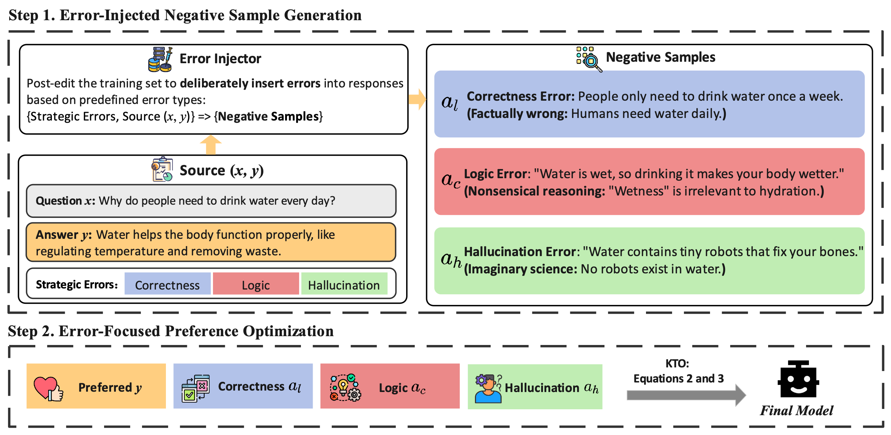

# SeaPO: Strategic Error Amplification for Robust Preference Optimization of Large Language Models

The entire process of **SeaPO** consists of two parts: 
1. Error-Injected Negative Sample Generation: We use the original data pairs and specific error types as inputs to an error injector, allowing for controlled injection of specific types of errors into the negative samples. In this step, we generate three types of errors. 
2. Error-Focused Preference Optimization: We generate three corresponding negative samples by introducing specific errors into the original QA pairs. During training, we randomly select one of the three negative samples and pair it with the original positive sample as a preference training pair.



# Usage

## Data Generation

1. First, download the initial dataset, *UltraFeedback*, from HuggingFace by running the following command:

```bash
cd data_generation

python get_ultrafeedback.py
```

2. After downloading the dataset, inject specific errors to create the KTO dataset by running the following command:

```bash
python inject_error.py --model_path <model_path> --error_type <error_type> --output_path <output_path>
```
For example, we can use the following command to inject logic errors into the *UltraFeedback* dataset:
```bash
python inject_error.py \
  --model_path /data/models/Qwen2.5-7B-Instruct \
  --error_type logic \
  --output_path ultrafeedback-logic-kto-by-qwen-7b.json
```

## Training

We utilize the open-source framework [LLaMA-Factory](https://github.com/hiyouga/LLaMA-Factory.git) for training. 

After obtaining the KTO dataset in the previous step, move it to the `LLaMA-Factory/data` directory. Next, edit the `dataset_info.json` file in `LLaMA-Factory/data` to include the dataset information. **Refer to the format in kto_en_demo for guidance**:

```json
"kto_en_demo": {
    "file_name": "kto_en_demo.json",
    "formatting": "sharegpt",
    "columns": {
      "messages": "messages",
      "kto_tag": "label"
    },
    "tags": {
      "role_tag": "role",
      "content_tag": "content",
      "user_tag": "user",
      "assistant_tag": "assistant"
    }
  },
```

Afterwards, use the `LLaMA-Factory/kto.sh` script to start KTO training:
```bash
cd LLaMA-Factory

bash kto.sh
```
The following command example shows how to train Qwen2.5-7B-Instruct using the **kto_en_demo** dataset:
```bash
BASE_MODEL="Qwen2.5-7B-Instruct"
MODEL_NAME="qwen2.5-7b-instruct-kto-demo"

llamafactory-cli train \
    --stage kto \
    --do_train True \
    --model_name_or_path /data/models/$BASE_MODEL \
    --preprocessing_num_workers 16 \
    --finetuning_type lora \
    --template qwen \
    --flash_attn auto \
    --dataset_dir data \
    --dataset kto_en_demo \
    --cutoff_len 2048 \
    --learning_rate 5e-06 \
    --num_train_epochs 3.0 \
    --max_samples 1000000 \
    --per_device_train_batch_size 2 \
    --gradient_accumulation_steps 8 \
    --lr_scheduler_type cosine \
    --max_grad_norm 1.0 \
    --logging_steps 5 \
    --save_steps 5000 \
    --warmup_steps 0 \
    --packing False \
    --report_to none \
    --output_dir saves/$BASE_MODEL/lora/$MODEL_NAME \
    --bf16 True \
    --plot_loss True \
    --trust_remote_code True \
    --ddp_timeout 180000000 \
    --include_num_input_tokens_seen True \
    --optim adamw_torch \
    --lora_rank 8 \
    --lora_alpha 16 \
    --lora_dropout 0 \
    --lora_target all \
    --pref_beta 0.1 \
    --pref_ftx 0 \
    --pref_loss sigmoid
```
The main parameters to focus on are `template` and `dataset`.
The `template` refers to the dialogue template; to train the Llama model, replace “qwen” with “llama.”
For the `dataset`, the dataset name should be specified in the `dataset_info.json` file.
```bash
llamafactory-cli export \
    --model_name_or_path /data/models/$BASE_MODEL \
    --adapter_name_or_path saves/$BASE_MODEL/lora/$MODEL_NAME \
    --template qwen \
    --finetuning_type lora \
    --trust_remote_code true \
    --export_dir /data/trained_models/$MODEL_NAME \
    --export_size 5 \
    --export_device cpu \
    --export_legacy_format
```
These two steps are performed sequentially in the `kto.sh` script.

Alternatively, you can conveniently train models using the LLaMA-Factory UI. To launch the UI service, run the following command, and follow the instructions provided in the web interface. For more detailed guidance, refer to the `LLaMA-Factory/README.md`.

```bash
cd LLaMA-Factory

llamafactory-cli webui
```

## Evaluation
We utilize the open-source framework [open-instruct](https://github.com/allenai/open-instruct.git) for evaluation.

Begin by running the following command to prepare the evaluation data:
```bash
cd open-instruct

bash scripts/data/prepare_eval_data.sh
```
Next, execute the following command to initiate the evaluation:
```bash
bash scripts/eval/all.sh <GPU_ID> <MODEL>
```
To display the evaluation results, use the following command:
```bash
python show_eval_results.py --models <MODEL>
```
For example, we can run the following command to evaluate the trained `qwen2.5-7b-instruct-kto-demo` model:
```bash
bash scripts/eval/all.sh 0 /data/trained_models/qwen2.5-7b-instruct-kto-demo

python show_eval_results.py --models qwen2.5-7b-instruct-kto-demo
```